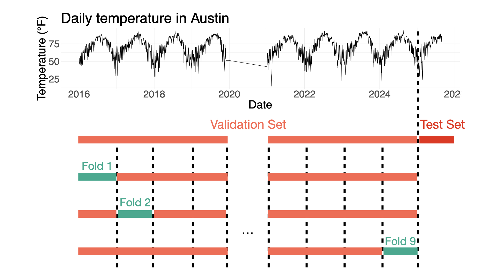

<!-- README.md is generated from README.Rmd. Please edit that file -->

```{r, include = FALSE}
knitr::opts_chunk$set(
  collapse = TRUE,
  comment = "#>",
  fig.path = "man/figures/README-",
  out.width = "100%"
)
```

# dynamicAutoregCV

<!-- badges: start -->
<!-- badges: end -->

The goal of dynamicAutoregCV is to create a linear ridge autoregression algorithm for time-series forecasting with dynamic training. The main features of the package include:

- A cross-validation scheme that allows us to find the best regularization parameter and number of lags for the validation set.
- Dynamic forecasting for the test set, moving the training window each time a new value is incorporated.




## Installation

You can install the development version of dynamicAutoregCV from [GitHub](https://github.com/) with:

``` r
# install.packages("pak")
pak::pak("LeonardoCazares/finalproject_leonardocazares")
```

## Work to be done...

For the rest of the project the task will be completed:

- Using the functions created, apply the cross-validation algorithm to a grid of values for the regularization parameter in the ridge regression and for the number of lags.
- Create and apply a function for the dynamic training/prediction step.
- Complete the remaining vignettes.
- [EXTRA] If possible, apply a conformal prediction algorithm for the uncertainty quantification of the time-series forecasts.

