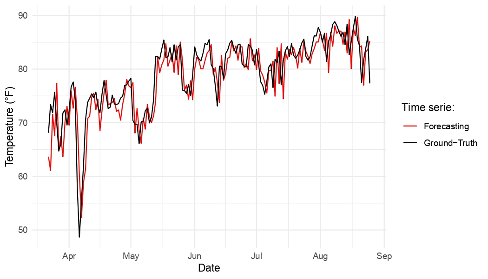

<!-- README.md is generated from README.Rmd. Please edit that file -->

# dynamicAutoregCV

<!-- badges: start -->

<!-- badges: end -->

## Objective

The goal of dynamicAutoregCV is to create a linear ridge autoregression
algorithm for time-series forecasting with dynamic training. The main
features of the package include:

- A cross-validation scheme that allows us to find the best
  regularization parameter (for ridge regression) and the number of lags
  considered for the autogressive settings.

<figure>

<figcaption aria-hidden="true">Figure 1. Cross-validation for time
series.</figcaption>
</figure>

- Dynamic forecasting for the test set, moving forward the training
  window training epoch.

<figure>

<figcaption aria-hidden="true">Figure 2. Time series out-of-sample
forecasting.</figcaption>
</figure>

## Data

To acomplish the two features mentioned above we prepared a dataset of
average daily temperature in Austin, TX (extracted from the National
Centers for Environmental Information
[NCEI](https://www.ncei.noaa.gov)). The dataset covers the period from
2016-01-01 to 2025-08-25, with measurements in °F.

## Functions

The function created for the project covers:

### `train_test_split()`

Splits a univariate time series into training and testing sets based on
a percentage cutoff.

``` r
train_test_data <- train_test_split(x, dates, p = 0.05)
train_test_data$x_train
train_test_data$x_test
train_test_data$dates_train
train_test_data$dates_test
```

### `fit_ar_l2()`

Fits an autoregressive model with L2 (ridge) regularization.  
Takes a univariate time series and a set of lags, solves the closed-form
ridge estimator, and returns fitted values, coefficients, and error
metrics.

### `cv_ar_l2()`

Performs K-fold blocked cross-validation ([Schnaubelt M.,
2019](https://www.econstor.eu/bitstream/10419/209136/1/1684440068.pdf))
over a grid of regularization parameters and/or lag values.  
Returns the mean validation error for each combination and identifies
the optimal hyperparameters.

### `dynamic_regression()`

Implements dynamic (rolling-window) training and forecasting.  
At each time step, the model is re-trained using only the most recent
observations in a sliding window.  
Returns rolling predictions, error metrics, and the model sequence.

### `rmse()`

Computes the Root Mean Squared Error (RMSE) between the ground-truth
time serie and the forecasting.

## Installation

You can install the development version of dynamicAutoregCV from
[GitHub](https://github.com/) with:

``` r
# install.packages("pak")
pak::pak("LeonardoCazares/finalproject_leonardocazares")
```

## Work to be done…

- \[EXTRA\] If possible, apply a conformal prediction algorithm for the
  uncertainty quantification of the time-series forecasts.
